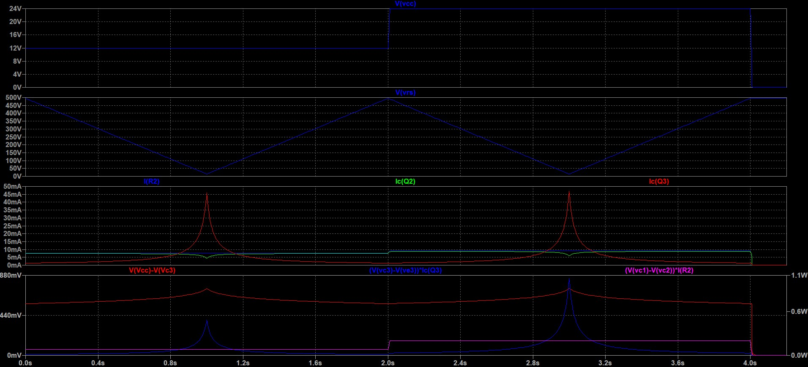
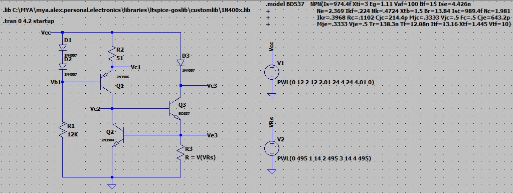

# Diode tester
A simple tester to measure, under different current values, the voltage drop across a diode when forward biased, or the working voltage of a zener diode when reverse biased.
 
The circuit may be powered from $12VDC$ to $24VDC$. Obviously the maximum measurable zener voltage depends on the supply voltage.

## Specifications

### Features
- supply voltage from $12VDC$ to $24VDC$
- protection against reverse polarity of the supply voltage
- adjustable load current between about $1.5mA$ and $50mA$

### LTspice Simulation

 

##### Note: 
In the worst case, i.e. with maximum supply voltage ($24VDC$) and maximum load current ($50mA$), transistor Q3 must be able to dissipate more than $1W$.

In the simulation, a value of $H_{FE}=15$ was set for the transistor BD537.

### Circuit calculations
#### Load driver network:
The load current must be adjustable between about $1.5mA$ and $50mA$:

$I_{C3} = V_{BE2}/R_3 \implies R_{3_{1.5mA}} = 350$&Omega; and $R_{3_{50mA}} = 14$&Omega; $\implies$  
$R_{3a} = 15$&Omega;, $R_3 = 470$&Omega;

$P_{R_{3_{MAX}}} = I_{C_{3_{MAX}}}^2 * R_{3_{MAX}} = 38mW$

$V_{CE_3} = V_{CC} - V_{load} - V_{BE_2}$

Assuming: $V_{load_{MIN}} = 0.3V$ (for a forward biased schottky diode) and $V_{load_{MAX}} = 18V$ (for a reverse biased zener diode)

$V_{CE_{3_{12V}}} = (2.3 - 11.1)V$ and $V_{CE_{3_{24V}}} = (5.3 - 23.1)V \implies V_{CE} = (2.3 - 23.1)V$

$P_{Q_{3_{MAX}}} = V_{CE_{3_{MAX}}} * I_{C_{3_{MAX}}} = 1.1W$

Assuming: $H_{FE_3} \geq 15$

$I_{B_{3_{MIN}}} = I_{C_{3_{MAX}}}/H_{FE_3} = 3.3mA$

#### Control & reference network:
$V_{CE_2} = V_{BE_2} + V_{BE_3} = 1.4V$

$2*V_D = 1.4V = V_{BE_1} + V_{R_2} * I_{R_2}$

Assuming: $I_{R_2} = 10mA => R_2 = 51$&Omega;

$V_{CE_1} = V_{CC} - V_{R_2} - V_{CE_2} \implies V_{CE_1} = (9.1 - 21.1)V$

$P_{Q_{1_{MAX}}} = V_{CE_{1_{MAX}}} * I_{R_2} = 250mW$

$P_{Q_{2_{MAX}}} = V_{CE_2} * (I_{R_2} - I_{B_3}) = 10mW$

$V_{R_1} = V_{CC} - 2* V_D = (10.6 - 22.6)V \implies I_{R_1} = V_{R_1}/R_1 = (.9 - 1.9)mA \implies P_{R_{1_{MAX}}} = I_{R_{1_{MAX}}}^2*R_1 = 43mW$ 

### Hardware
Schematics and PCB layouts are designed with ExpressPCB free CAD software.

#### Schematic:

#### PCB Layout:

## About
Author : Alessandro Fraschetti (mail: [gos95@gommagomma.net](mailto:gos95@gommagomma.net))

## Licence
This project is under the [MIT license](LICENSE).
You are free to use this for any purpose, just try to give credit in the documentation of your project.
