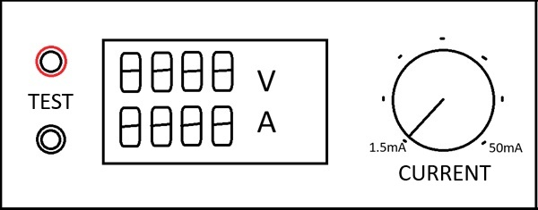
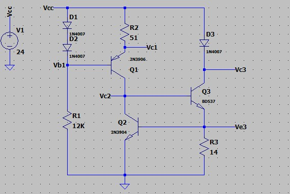
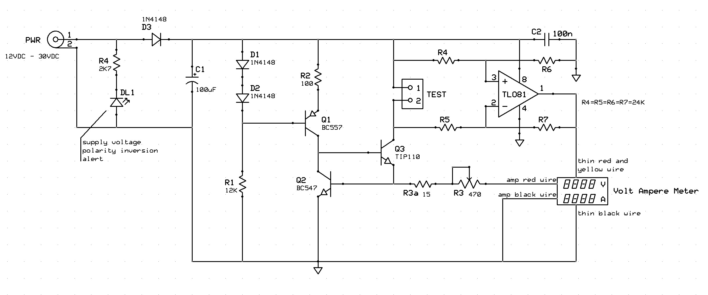
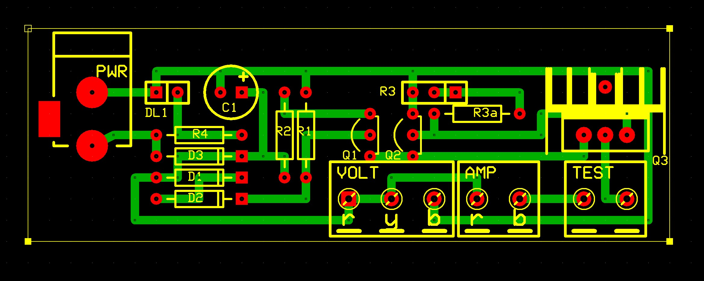

# Diode tester
A simple tester to measure, under different current values, the voltage drop across a diode when forward biased, or the working voltage of a Zener diode, when reverse biased.
 
The circuit may be powered from $12VDC$ to $30VDC$. Obviously the maximum measurable zener voltage depends on the supply voltage.

## Specifications

### Features
- supply voltage from $12VDC$ to $30VDC$
- variable load current from $0$ to $50mA$

## PSpice simulation

 

#### Note: 
In the worst case, i.e. with maximum supply voltage ($30VDC$) and load current ($50mA$), Q3 must be able to dissipate more than $1W$.

In the simulation, a value of $H_{FE}=15$ was set for the BD537.

### Hardware
Schematics and PCB layouts are designed with ExpressPCB free CAD software.

#### Schematic:

#### PCB Layout:

## About
Author : Alessandro Fraschetti (mail: [gos95@gommagomma.net](mailto:gos95@gommagomma.net))

## Licence
This project is under the [MIT license](LICENSE).
You are free to use this for any purpose, just try to give credit in the documentation of your project.
