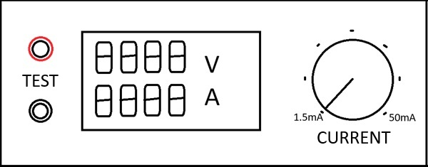
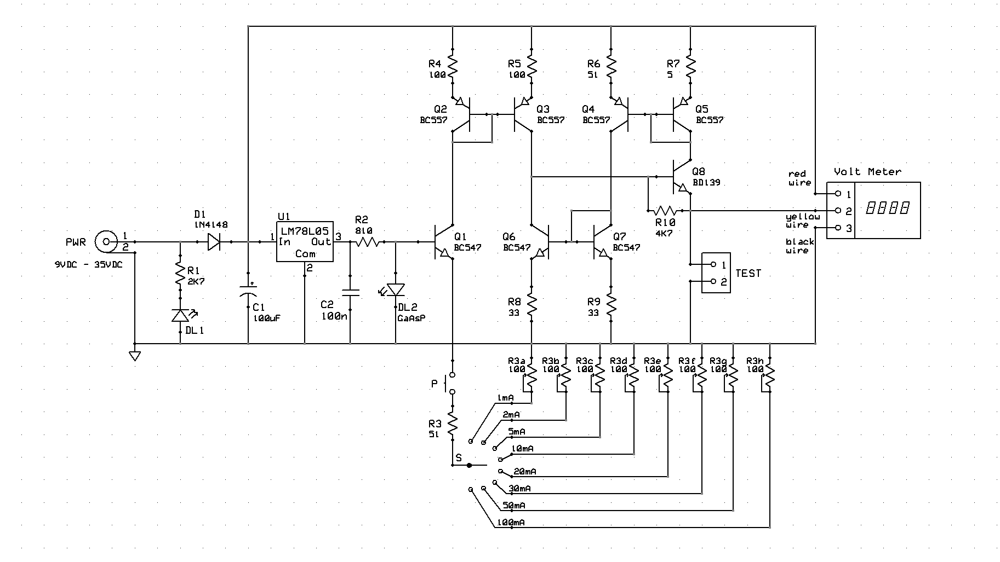
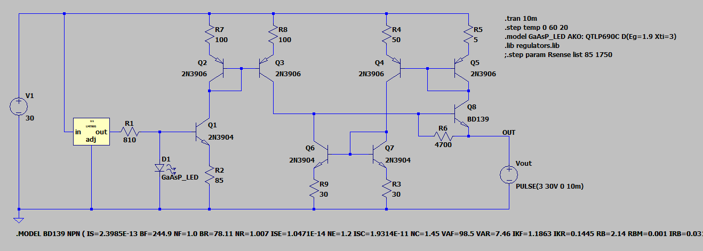
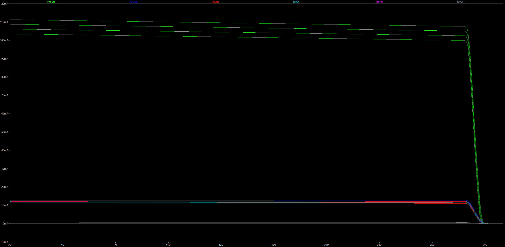
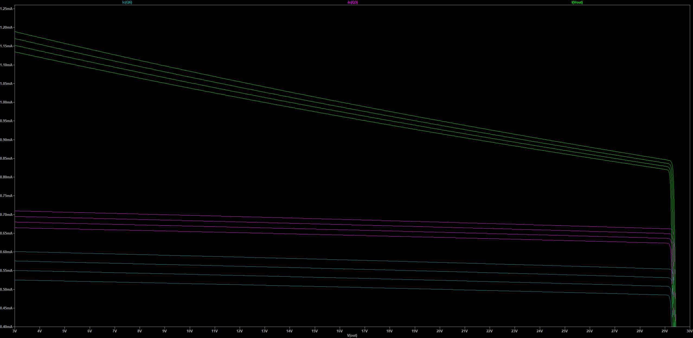
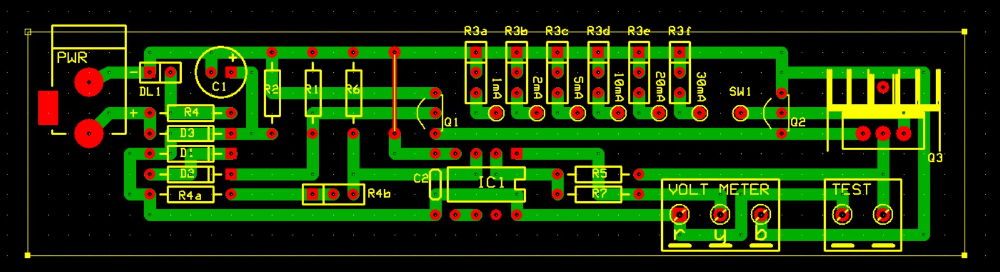

# Diode tester
**Type**: Component Tester | **Status**: Developing

A simple tester to measure, under different current values, the voltage drop across a diode when forward biased, or the working voltage of a Zener diode when reverse biased.

The circuit may be powered with a DC-Adapter from $9VDC$ to $30VDC$, obviously the maximum measurable zener voltage depends on the supply voltage.

The circuit allows testing of different types of diodes that require distinct minimum activation currents. For this reason, the current flowing through the diode under test can be selected via a rotary switch connected to independent trimming sections, from a minimum of about $1mA$ up to $100mA$. This also allows to observe the variations in voltage drop ($V_f$​ or $V_Z$​) across different current ranges.

## Specifications
* **Diode Test:** Measure forward voltage drop ($V_f$) under selectable current values.
* **Zener Test:** Measure working voltage (up to $V_{CC}$ minus a few volts) under selectable current values.
* **Supply Voltage ($V_{CC}$):** $9VDC$ to $30VDC$ via standard DC-Adapter.
* **Load Current:** Adjustable from $1mA$ up to $100mA$ across 8 selective ranges.
* **Display:** 3-pin LED digital display of the voltage across the diode under test.
* **Protection**: Input reverse polarity protection.

## Design

### Schematic

### Circuit Analysis
This project started from an apparently simple question: how can a ground-referenced diode tester (e.g. to use a simple 3-wire voltmeter) provide a selectable sourcing current without relying on specialized high-voltage ICs?
The resulting circuit turned into an exploration of discrete current mirrors and their use within a classic topology.

The circuit operates with an input voltage ($V_{CC}$) of up to 30V and delivers a selectable, ground-referenced sourcing output current ($I_{out}$) ranging from 1mA to 100mA into a low-side load.

#### 1. Constant Current Reference ($I_{ref}$ *sink*)
The left section of the schematic implements a ground-referenced constant current sink $I_{ref}$.
Led $DL_2$, (a standard GaAsP diffused red LED), establishes a stable, low reference voltage at the base of $Q_1$ (approximately $1.6V$ to $1.8V$) while providing basic thermal compensation.
The reference current $I_{ref}$ flowing into $Q_1$ is selected via the emitter resistor network managed by switch $S$ ($R_3 + R_{3x}$):
$$I_{ref} \approx \frac{V_{DL2} - V_{BE1}}{R_3 + R_{3x}}$$
 *Because the selection takes place on the emitter side of $Q_1$, the entire current control block safely operates at low voltage relative to ground.

On the left-side of $Q_1$, assuming $V_{DL2} \approx 1.8V$, $V_{BE1} \approx 0.65\text{V}$, $I_{U1} \approx 5mA$ (regulator quiescent current):

$I_{DL2} = \frac{{V_{U1_{OUT}}} - V_{DL2}}{R_2} \approx 4mA$

$P_{R2} = I_{R2}^2 \times R_2 = (4.14\text{mA})^2 \times 810\Omega \approx 14\text{mW}$
$P_{U1} = (V_{CC} - V_{U1_{OUT}}) \times (I_{DL2} + I_{U1}) = 225mW$

For a $\text{LM}7805$ in a TO-126 package: $\theta_{ja} \approx 65^{\circ}\text{C/W}$.
$T_j = T_a + \theta_{ja} \times P_{U1} \approx 30^{\circ} C + 15^{\circ} C = 45^{\circ} C$

On the right-side of $Q_1$:
In the absolute worst-case scenario where $R_{3x} \to 0\Omega$, the reference current reaches its theoretical upper limit determined solely by the fixed degeneration resistor $R_3 = 51\Omega$.
$I_{ref_{max}} = (V_{DL2} - V_{BE1})/R3 \approx 23mA$
$P_{R3} = I_{ref\_max}^2 \times R_3 \approx 26\text{mW}$
$V_{CE1\_max} = V_{CC} - R_4 \times I_{ref_{max}} - V_{BE2} - R_3 \times I_{ref_{max}} = 30\text{V} - 2.3\text{V} - 0.65\text{V} - 1.17\text{V} \approx 26\text{V}$
$P_{Q1\_max} = V_{CE1\_max} \times I_{ref_{max}} = 600\text{mW}$

For a BD139 ($\text{TO}126$ package, $\theta_{ja} \approx 100^{\circ}\text{C/W}$):
$T_j = T_a + \theta_{ja} \times P_{Q1_{max}} \approx 30^{\circ}\text{C} + 60^{\circ}\text{C} = 90^{\circ}\text{C}$

*Note: Under normal calibrated loop operation for $I_{out} = 100\text{mA}$, the active simulation shows $I_{ref}$ settles around $12\text{mA}$, making this a very conservative safety boundary calculation).*
#### 2. Upper Current Mirror ($I_{ref}$ *source*)
To inject (*source*) current into the diode under test, the reference current $I_{ref}$ must be flipped relative to the positive supply rail. Transistors $Q_2$ and $Q_3$ act as an upper current mirror that steers $I_{ref}$ ($I_{C3} \approx I_{ref}$) into the base node of the pass-transistor $Q_8$.

Assuming, as the worst scenario, a short on the load ($V_{load\_min} = 0V$);
$V_{CE3\_max} = V_{CC} - R_5 \times I_{ref_{max}} - V_{B8} = V_{CC} - R_5 \times I_{ref_{max}} - (V_{load\_min} + V_{BE8}) = 30\text{V} - 2.3\text{V} - 0.65\text{V} \approx 27\text{V}$
$P_{Q3\_max} = V_{CE3\_max} \times I_{ref_{max}} = 620\text{mW}$
#### 3. Output Power Stage (Pass-Transistor)
Transistor $Q_8$ acts as the series regulating element (*pass-transistor*), directly sourcing the test current to the load from its emitter terminal. Resistor $R_{10}$ (bleeder resistor), tied across the base-emitter junction of $Q_8$, provides a discharge path for leakage currents, ensuring a fast and clean turn-off of the pass-transistor when the circuit is idle or open-circuited.

Assuming a forward-biased Schottky as load ($V_{load\_min} = 0.3V$), and $I_{out} = 100mA$:
$V_{CE8\_max} = V_{CC} - R_7 \times I_{out} - V_{BE5} - V_{load\_min} \approx 30\text{V} - 0.5\text{V} - 0.65\text{V} - 0.3\text{V} \approx 28.5\text{V}$
$P_{Q8\_max} = V_{CE8\_max} \times I_{out\_max} = 2.85\text{W}$

For a $\text{BD}139$ in a TO-126 package: $\theta_{jc} \approx 10^{\circ}\text{C/W}$. To safely keep $T_j \leq 90^{\circ}\text{C}$, the total allowed thermal resistance is: 

$\theta_{tot\_allowed} = \frac{T_{j\_target} - T_A}{P_{Q8\_max}} = \frac{90^{\circ}\text{C} - 30^{\circ}\text{C}}{2.85\text{W}} \approx 21^{\circ}\text{C/W}$

$\theta_{heatsink} = \theta_{tot\_allowed} - \theta_{jc} - \theta_{case-to-sink} \approx 21 - 10 - 1 = 10^{\circ}\text{C/W}$

**$Q_8$ must be equipped with a heatsink**.

***Design note on $R_{10}$:** The exact low-current behavior of the discrete mirrors cannot be predicted analytically with sufficient confidence, but their degradation at very small currents is expected. $R_{10}$ serves the conventional role of a base-emitter bleeder resistor for $Q_8$, but its  value was chosen to remain non-negligible at the minimum output setting, to provide an alternate current path within regulation loop. Simulation was then used to refine its value to result in a contribution of approximately 15–20% of the nominal output current under worst-case low-current conditions.*
#### 4. Current Feedback Loop ($\beta$ compensation)
To compensate variations in the current gain ($h_{FE}$) of $Q_8$, the circuit integrates a current feedback loop consisting of two cascaded current mirrors ($Q_4, Q_5$ and $Q_6, Q_7$).
**First Mirror ($Q_4, Q_5$)**: This stage samples a geometric percentage of the current delivered by the pass-transistor:
$$I_{feedback} = \frac{R_7}{R_6} \times I_{out} \approx \frac{1}{10} I_{out} $$
**Second Mirror ($Q_6, Q_7$):** this secondary stage inverts the sign of the previously sampled current. The resulting current ($1/10 \cdot I_{out}$) is fed directly back into the base node of the pass-transistor $Q_8$, acting **in subtraction** against the reference current $I_{ref}$. This closed-loop negative feedback dynamically stabilizes the load current.
 
 ***Notes**: At the minimum current setting ($Iout=1mA$), the discrete mirrors progressively deviate from their ideal geometric behavior because of finite Early voltage effects.*

#### 5. Push-Button P and Thermal Considerations
The circuit is designed for intermittent operation rather than continuous load delivery. The activation is limited to the few seconds required to read the voltage on the display. This pulsed behavior introduces a significant safety margin, components experience power dissipation only in short transients.

### LTspice Simulation
The circuit's performance was evaluated under thermal sweeps ($0^{\circ} C$ to $60^{\circ} C$ with a step of $20^{\circ} C$) and dynamic load conditions (sweeping $V_{out}$​ compliance voltage from $0V$ up to $30V$).

#### High-current Regime ($I_{out} = 100mA$)

At the highest range (100mA nominal), the load regulation curve is nearly flat. The current through the mirrors are well expressed by the circuit geometries.
#### Low-current Regime ($I_{out} = 1mA$)

At the lowest selectable setting (1mA nominal), the output current exhibits a sloped behavior, due to the Early effects on $Q_6$ and $Q_3$. As the mirror currents lose strict linearity and shift toward a higher value at the output, the feedback loop on $Q_8$ becomes more aggressive. In this scenario, resistor $R_{10}$ helps $Q_8$ maintain a stable and controlled output current.

#### Compliance Boundary
With $V_{CC} = 30\text{V}$, the maximum compliance voltage is approximately 28V.

## Implementation and Test

### PCB Layout
The circuit was assembled on a custom PCB (perfboard).

### Calibration Procedure
Calibration is required to compensate for component tolerances by configuring each of the 8 rotary switch positions to its exact target value.
1. Connect a multimeter set to DC Current mode across the TEST terminals.
2. For each switch position, adjust the corresponding trimmer ($R_{3a}$ through $R_{3h}$) until the multimeter displays the target current ($1mA$, $2mA$, $5mA$, $10mA$, $20mA$, $50mA$, $100mA$).

### Test Log

**Supply Voltage Sensitivity and Output Compliance**:
|VCC|Iout|
|---|--:|
|9 V||
|12 V||
|24||
|30||

**Thermal Stability**:

**The Role of $R_{10}$**:
To verify the low-current behavior, the voltage across $R_{10}$ was measured at different output current values, and used to estimate the fraction of current flowing through the resistor. The measured contribution was compared against the 15–20% predicted by simulation.
|Iout nominal|VR10|IR10|IR10/Iout|
|---|--:|--:|--:|
|1 mA|...|...|...|
|2 mA|...|...|...|
|5 mA|...|...|...|

**Some device measures**:
|Device|1 mA|10 mA|100 mA|
|---|--:|--:|--:|
|1N4148|0.58 V|0.67 V|0.83 V|
|1N5819|0.22 V|0.29 V|0.39 V|
|LED rosso|1.58 V|1.74 V|1.92 V|
## Conclusions
**Results**: At $V_{CC}=30V$ the circuit may be capable of measuring all Zener breakdown voltages $V_Z$ up to $27V$.
  
**Suggestions**: 

**Evolutions**: Higher-voltage operation raised the question of how to derive bounded internal supply rails from a wider input range. The exploration of alternative voltage reduction strategies has been documented separately in the [Voltage Reduction Circuits](https://github.com/gom9000/xp-circuit-blocks/tree/master/voltage-reduction-circuits)  experience of [Circuit Blocks eXPerience](https://github.com/gom9000/xp-circuit-blocks/tree/master) repo.

## Changes
See file [CHANGES](CHANGES.md) for the project resources change logs.

## Future Plans
See file [TODO](TODO.md) for the project future plans.

## About & License
**Author**: Alessandro Fraschetti (gom9000). 
**Technical Notes**: The hardware design was supported by **ExpressPCB** and the custom **[expresspcb-goslib](https://github.com/gom9000/expresspcb-goslib)** libraries. 
**License**: This experience is licensed under the [MIT License](LICENSE).