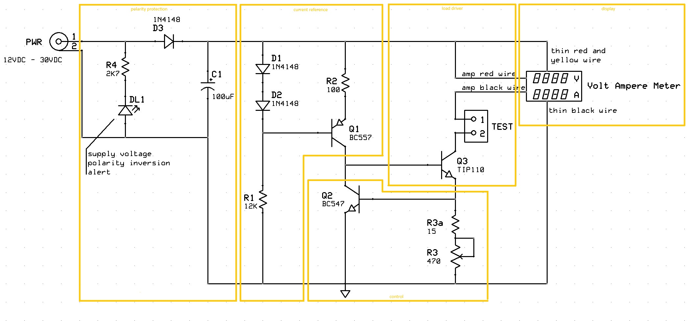
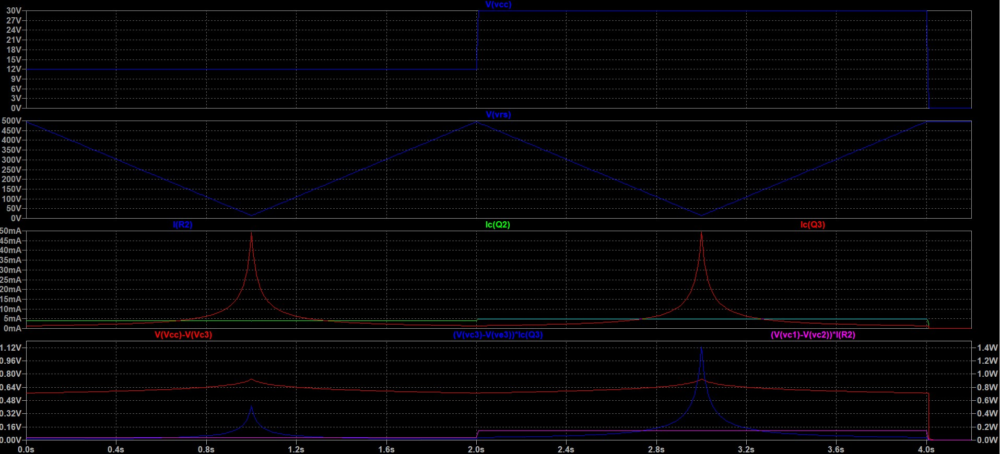
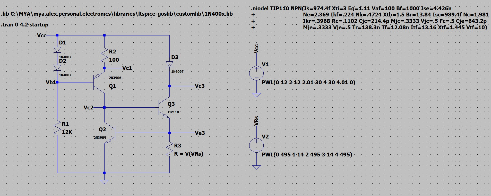

# Diode tester
A simple tester to measure, under different current values, the voltage drop across a diode when forward biased, or the working voltage of a zener diode when reverse biased. 
The circuit may be powered with a DC-Adapter $12VDC$ or $24VDC$. Obviously the maximum measurable zener voltage depends on the supply voltage.

## Specifications

### Features
- supply voltage from DC-Adapter $12V$ or $24VDC$
- protection against reverse polarity of the supply voltage
- adjustable load current between $1.5mA$ and $50mA$
- display voltage and current across the diode under test

### Schematic
Schematic and PCB layout are designed with ExpressPCB free CAD software.

### Circuit
#### Load driver network:
The load current must be adjustable between $1.5mA$ and $50mA$:

$I_{C3} = V_{BE2}/R_3 \implies R_{3_{1.5mA}} = 470$&Omega; and $R_{3_{50mA}} = 15$&Omega; $\implies$  
$R_{3a} = 15$&Omega;, $R_3 = 470$&Omega;

$P_{R_{3_{MAX}}} = I_{C_{3_{MAX}}}^2 * R_{3_{MAX}} = 38mW$

$V_{CE_3} = V_{CC} - V_{load} - V_{BE_2}$

Assuming: $V_{load_{MIN}} = 0.3V$ (for a forward biased schottky diode) and $V_{load_{MAX}} = 18V$ (for a reverse biased zener diode):

$V_{CE_{3_{12V}}} = (2.3 - 11.1)V$ and $V_{CE_{3_{24V}}} = (5.3 - 23.1)V \implies V_{CE} = (2.3 - 23.1)V$

$P_{Q_{3_{MAX}}} = V_{CE_{3_{MAX}}} * I_{C_{3_{MAX}}} = 1.1W$

A medium-power transistor is needed for Q3. 
It is best to use a Darlington, which has a high $H_{FE}$, so as to keep its base current small, and also the reference current of Q1. Assuming: $H_{FE_3} \geq 1000$

$I_{B_{3_{MIN}}} = I_{C_{3_{MAX}}}/H_{FE_3} = 50$&micro;$A$

With a small heatsink (&Theta;$_{hs} = 5$ &deg;$C/W$) and assuming $T_A = 30$&deg;$C$:

$T_{Q_{3_{MAX}}} = T_A + P_{Q_{3_{MAX}}}*($&Theta;$_{jc} + $&Theta;$_{hs}) = 40$ &deg;$C$

#### Control & current reference network:
The role of the current reference network (a constant current generator) is to absorb the differences in the choice of the Vcc value. In this way, the choice of Vcc determines only the maximum value of the Zener voltage that can be measured (tested) by the circuit.

$V_{CE_2} = V_{BE_2} + V_{BE_3} = 1.4V$

$2*V_D = 1.2V = V_{BE_1} + V_{R_2} * I_{R_2}$

Assuming: $I_{R_2} = 5mA => R_2 = 100$&Omega;

$V_{CE_1} = V_{CC} - V_{R_2} - V_{CE_2} \implies V_{CE_1} = (9.1 - 21.1)V$

$P_{Q_{1_{MAX}}} = V_{CE_{1_{MAX}}} * I_{R_2} = 115mW$

$P_{Q_{2_{MAX}}} = V_{CE_2} * (I_{R_2} - I_{B_3}) = 7mW$

$V_{R_1} = V_{CC} - 2* V_D = (10.6 - 22.6)V \implies I_{R_1} = V_{R_1}/R_1 = (.9 - 1.9)mA \implies P_{R_{1_{MAX}}} = I_{R_{1_{MAX}}}^2*R_1 = 43mW$ 

### LTspice Simulation
Below is the simulation of the circuit with the LTspice software. 
The simulation plots currents, voltages and powers on the transistors of the circuit, assuming a forward biased diode as a load. The simulation considers 2 different values ​​of $V_{cc}$ $(12V, 30V)$, for each of which the resistance $R_3$ is linearly modified from the value $0$&Omega; to $470$&Omega;, and then brought back to the value $0$&Omega;. 
Plot 2 shows voltage as a unit of measurement on the Y-axis $(0-500V)$, but it should be read as the resistance in Ohms of R3 $(0-500$&Omega;$)$. 
For the simulation, the value $H_{FE}=1000$ was set for the transistor Q3.

  

### PCB Layout

## About
Author : Alessandro Fraschetti (mail: [gos95@gommagomma.net](mailto:gos95@gommagomma.net))

## Licence
This project is under the [MIT license](LICENSE).
You are free to use this for any purpose, just try to give credit in the documentation of your project.
